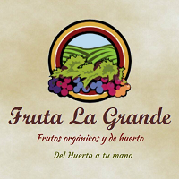

  MARJET PLACE FRUTA LA GRANDE 

## ¿Qué es Fruta La Grande?
Fruta La Grande un emprendimiento dedicado a la venta de frutas orgánicas con calidad y excelente precio.

Trababajan bajo la modalidad 'delivery' y llevan sus productos a distintos puntos de la capittal.

## Fundamentación / Presupuesto 

Para el presente proyecto decidimos usar las siguientes herramientas:

|Etapa de proceso design thinking|Actividad|Descripción|Puntos|
|:----|:----|:---|:---:|
|Descubrimiento e investigación|Entrevistas con cliente|Realización de entrevistas con el cliente (dueño del reto) y establecimiento de sus metas y objetivos.|25|
|Descubrimiento e investigación|Entrevistas con usuarios| Entrevistas en profundidad con al menos 5 usuarios. | 60 
|Ideación|Benchmark| Revisión de features de la competencia y referencias análogas. | 20 |
|Síntesis y definición|Flujo / árbol de contenidos|Documento que estructura contenidos y su navegación|15|
|Prototipado|Sketching y wireframing| Elaboración de prototipos de baja y mediana fidelidad. | 30 |
|Prototipado|Prototipado de alta fidelidad| Elaboración de prototipo en base a las pantallas diseñadas. | 80 |
|Testeo con usuarios|Testeos de prototipos| Sesiones de testing de la solución propuesta con al menos 5 usuarios. | 60 |

## **Descubrimiento e investigación** 
###  Antecedentes

De acuerdo a la Sociedad Peruana de Gastronomía (Apega), el consumo de productos orgánicos se ha incrementado en un 70% durante los últimos 10 años. Esta demando ha aumentado la oferta, por ello a la tradicional bioferia de Miraflores se han sumado otras ferias distritales y emprendimientos como **Fruta La Grande**.  

Estos últimos resultan importantes, porque según un informe de la revista Semana Económica, el valor económico de una canasta alimentaria de una tienda orgánica es un 73% mayor que una comprada en supermercado, y 48% mayor que una comprada en una bioferia. Y en términos generales una canasta alimntaria orgánica comprada en una tienda es 19% más cara que una comprada en una bioferia. (https://bit.ly/2nY2KjL) 

Teniendo en cuenta que no muchas de las tiendas no ofrecen servicio de delivery gratuito y y que las bioferias requieren que el usuario se desplace, este contexto favorece a nuestro cliete. 

### Entrevista con clientes
* Guía de preguntas.

* Respuestas de la guía de entrevistas con clientes

[**Lee las respuestas de la entrevista aqui**](https://docs.google.com/document/d/12VpwAbI-HoZvCIFqjcVVO8WL-G0JIk9yyMpmAeiIiAw/edit?usp=sharing)

* Conclusiones

En Fruta la Grande desean transmitir un servicio de calidad, caracterizándose por el buen trato al cliente, brindando una fruta adicional de cortesía. El proceso de venta consiste en la importación desde Ica, empaquetado en cajas personalizadas y envío por delivery. Trabajan 4 personas en total que comercializan 25 tipos de frutas. Los cobros son vía trasferencia por cuentas en BCP, Continental o Interbank, y actualmente pueden pasar sus tarjetas de crédito mediante VisaNet. Los trabajadores de Fruta La grande requiere los siguientes datos para la confirmación de un pedido: las cantidades, la dirección de envío , el teléfono, quién va recibir el envío y el medio de pago. El principal medio de comunicación es Facebook. 

Los principales clientes de Fruta La grande son mujeres divididas en dos categorías: mujeres de 18 a 20 años de edad, que normalmente consumen berries, arándanos, fresas y moras, y mujeres de 25 a más , que por lo general consumen papaya y piña. La zona con mayor cantidad de consumidores es Surco. Su distribución es a distritos segmentados de Lima (San Isidro, Surco, Miraflores). La frecuencia del pedido es semanal si es un cliente constante, si es un cliente nuevo, la frecuencia del pedido es cada dos semanas. Las características más resaltantes que los usuarios preguntan son: precio, delivery (gratuito), disponibilidad y horario de entrega. 
La cliente solicita una base de datos donde pueda visualizar el distrito, la dirección, frecuencia del cliente.

### Entrevista con usuarios

### Problemas identificados en la investigación (del cliente y del usuario)

## Síntesis de definición

### Flujo árbol de contenidos 

### Definición del público objetivo

    * User persona

    * Customer Journey Map (indicando pain y gain points)

### Definición de la solución/producto

## **Ideación**
### Benchmark

## **Prototipado**

### Sketching y wireframing

### Link a prototipo navegable 

### Prototipado de alta fidelidad

## **Testeo con usuarios**

### Testeo de prototipos

==============================

* Explicación de cómo los contenidos y funcionalidades responden a los objetivos
  del proyecto. 

* Explicación de cómo los contenidos y funcionalidades resuelven cada uno de las
  necesidades del usuario final.

* Link de Zeplin, InVision inspects o Marvel Hand-offs para compartir tus
  diseños con desarrolladores.

Un video en Loom de máximo 10 minutos explicando tu documento.
* Estos 10 minutos tienes que utilizarlos para explicar los puntos indicados en
  el `README.md` y para hacer un demo de la solución.

* Otros 
En las otras carpetas del repositorio o en las carpetas de Google Drive podrás
agregar los documentos complementarios que sustenten tu proceso:

* Fotos, videos, guías de las actividades que realizaste
* Flujo de usuario
* Mapa de sitio
* Etc